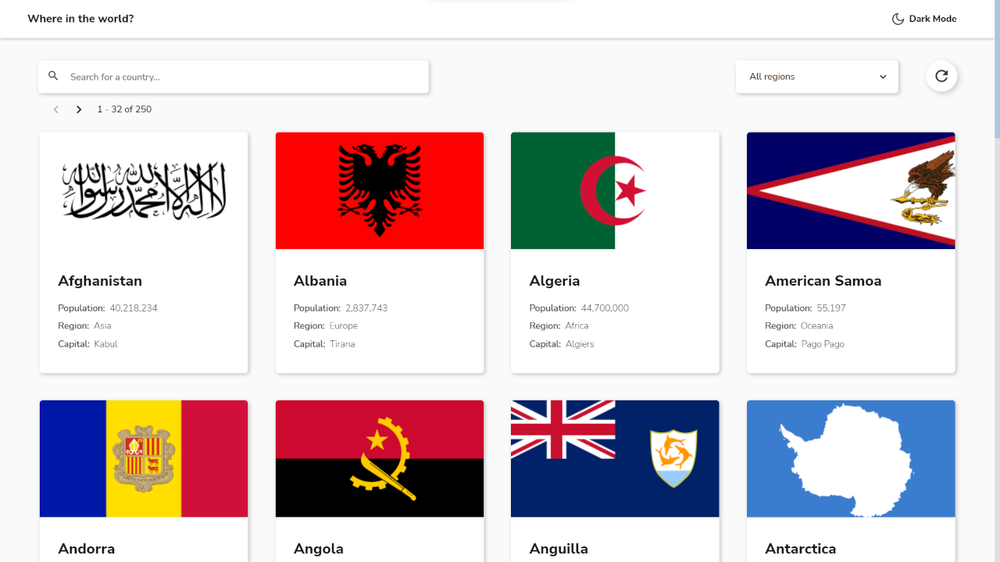
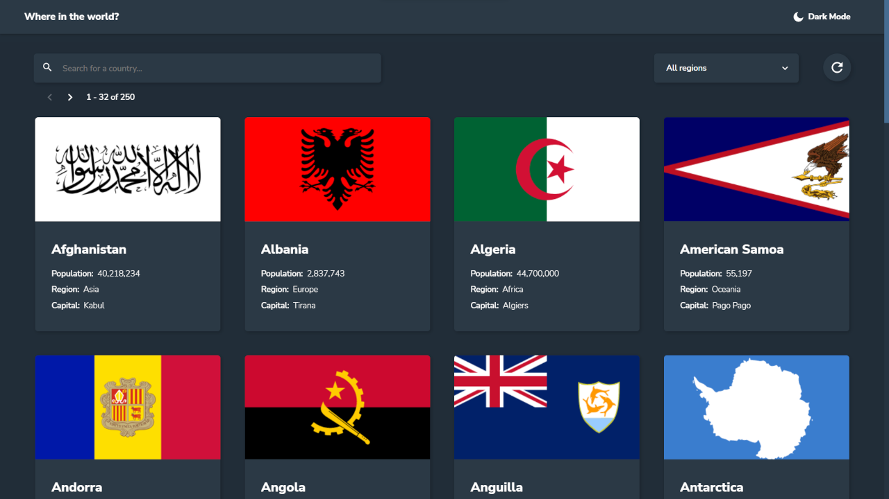
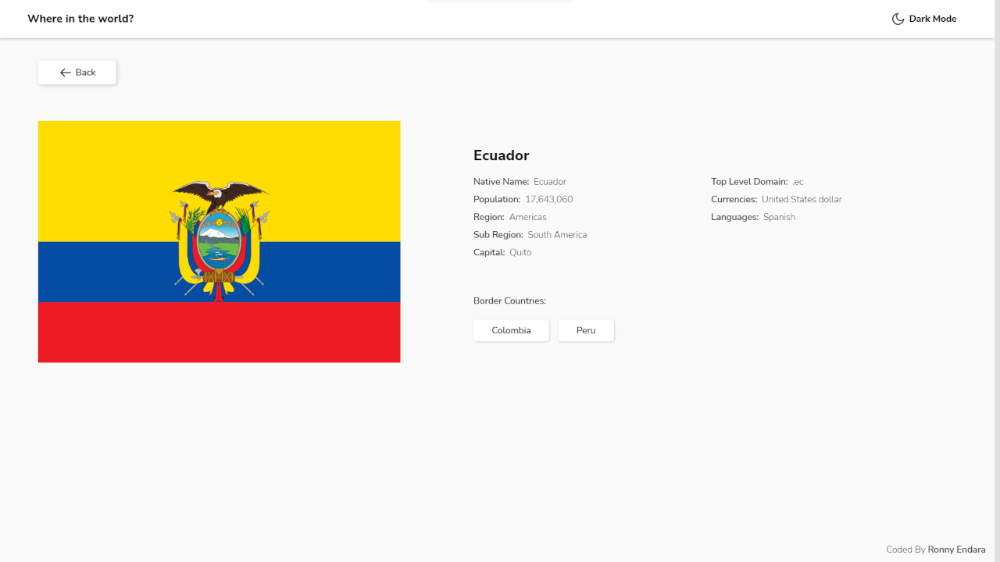
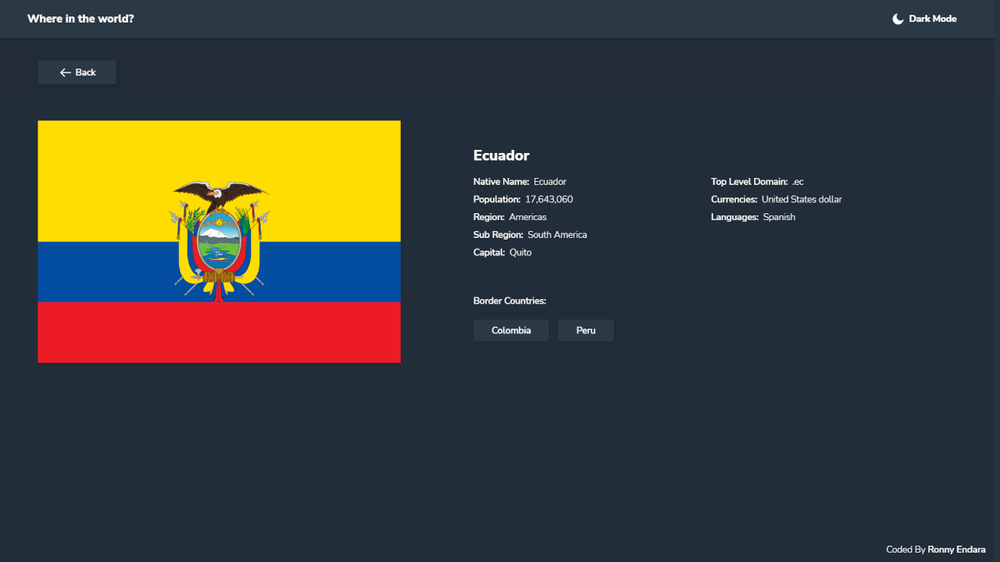
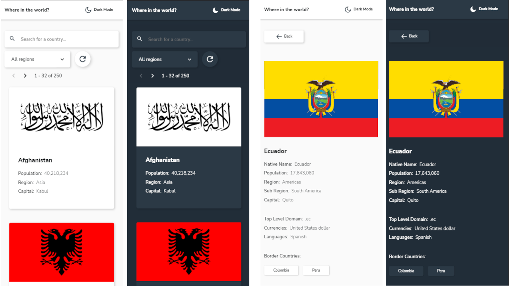
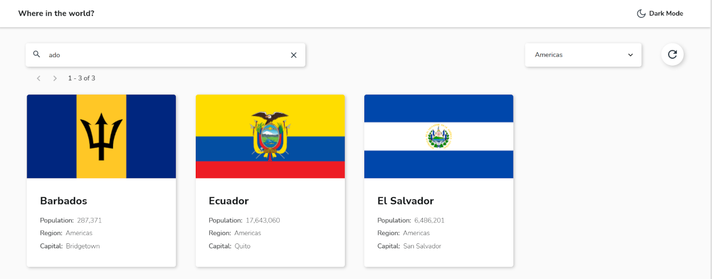
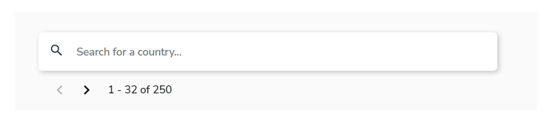

# Frontend Mentor - REST Countries API with color theme switcher solution

This is a solution to the [REST Countries API with color theme switcher challenge on Frontend Mentor](https://www.frontendmentor.io/challenges/rest-countries-api-with-color-theme-switcher-5cacc469fec04111f7b848ca). Frontend Mentor challenges help you improve your coding skills by building realistic projects. 

## Table of contents

- [Overview](#overview)
  - [The challenge](#the-challenge)
  - [Screenshots](#screenshots)
  - [Links](#links)
- [My process](#my-process)
  - [Built with](#built-with)
  - [Recommended IDE Setup](#recommended-ide-setup)
  - [Project Setup](#project-setup)
- [What I learned](#what-i-learned)
  - [Dark Mode](#dark-mode)
  - [DOM Optimization](#dom-optimization)
  - [SVG Icon Component](#svg-icon-component)
- [Continued development](#continued-development)
- [Useful resources](#useful-resources)
- [Author](#author)

## Overview

### The challenge

Users should be able to:

- See all countries from the API on the homepage
- Search for a country using an `input` field
- Filter countries by region
- Click on a country to see more detailed information on a separate page
- Click through to the border countries on the detail page
- Toggle the color scheme between light and dark mode

### Screenshots

**Desktop**  
Home view  
  

Home view - dark mode


Detail view


Detail view - dark mode 


**Mobile**


**Filter options**


### Links

- Live Site URL: [REST Countries API live site](https://github.io/rojaence/rest-countries-api/)
- Solution URL: [FrontendMentor Solution](#)

## My process

### Built with

- Semantic HTML5 markup
- BEM naming convention
- CSS custom properties
- Flexbox
- CSS Grid
- SCSS 
- Mobile-first workflow
- [Vue 3](https://vuejs.org/) - JS framework
- [Pinia](https://pinia.vuejs.org/) - Vue store
- [Vue Router](https://router.vuejs.org/) - Route management

### Recommended IDE Setup

This template should help get you started developing with Vue 3 in Vite.

[VSCode](https://code.visualstudio.com/) + [Volar](https://marketplace.visualstudio.com/items?itemName=Vue.volar) (and disable Vetur) + [TypeScript Vue Plugin (Volar)](https://marketplace.visualstudio.com/items?itemName=Vue.vscode-typescript-vue-plugin).

### Project Setup

```sh
npm install
```

#### Compile and Hot-Reload for Development

```sh
npm run dev
```

#### Compile and Minify for Production

```sh
npm run build
```

## What I learned


### Dark mode
The app theme is managed by a service that change the class in the root document with the theme setup, wich in turn that updates in the store. 

**Theme provider**  

```js
export default class ThemeProvider {
  constructor () {
    this.DARK_MODE_KEY = "RestCountriesApiDarkMode";
  }

  selectDarkMode(value) {
    value ? 
    document.documentElement.classList.add("theme--dark")
    : 
    document.documentElement.classList.remove("theme--dark")
  };

  setDarkMode() {
    let value = localStorage.getItem(this.DARK_MODE_KEY); 
    let response = false;
    if (value === "true") {
      localStorage.setItem(this.DARK_MODE_KEY, false)
      this.selectDarkMode(false);
    } else if (value === "false") {
      localStorage.setItem(this.DARK_MODE_KEY, true)
      this.selectDarkMode(true);
      response = true;
    } else {
      localStorage.setItem(this.DARK_MODE_KEY, false)
      this.selectDarkMode(false);
    }
    return response;
  }

  setThemeOnInit() {
    document.documentElement.classList.add("theme");
    let response = false;
    let value = localStorage.getItem(this.DARK_MODE_KEY); 
    if (value === "true") {
      this.selectDarkMode(true);
      response = true;
    } else if (value === "false") {
      this.selectDarkMode(false);
    } else {
      this.setDarkMode();
    }
    return response;
  };
}
```

**Use service**  

```js
import ThemeProvider from '@/services/ThemeProvider'

const indexStore = useIndexStore();
const themeProvider = new ThemeProvider();

// On init app - App.vue

onBeforeMount(() => {
  if (themeProvider.setThemeOnInit() === false) {
    indexStore.setDarkMode(false);
  } else {
    indexStore.setDarkMode(true);
  }
});

// On change with dark mode button - AppHeader.vue

const setAppTheme = () => {
  if (themeProvider.setDarkMode() === false) {
    indexStore.setDarkMode(false);
  } else {
    indexStore.setDarkMode(true);
  }
}
```

### DOM Optimization

The app has some transitions and animations, to optimize performance when loading or filtering data, I decided to program pagination that limits the number of DOM elements.

Showing all country cards (250) while leaking data or re-requesting from the API could slow down the browser; with paging, the DOM element limit is reduced from +4000 to just 547, in this particular case displaying 32 cards per page.



```html
<transition-group 
  class="countries-gallery__list" 
  ref="countriesList" 
  tag="ul" 
  name="list-transition">
  <li 
    class="countries-gallery__item" 
    v-for="(item, index) in filteredCountries.slice(initialIndex, finalIndex)" 
    :key="index">      
    <country-card 
      @click="showItemDetails(item)" 
      :data="item" 
      :dense="true">
    </country-card>
  </li>
</transition-group>
```

**Pagination control**  


```js
const initialIndex = ref(0);
const maxPageItems = 32;
const finalIndex = ref(0);

const prevPage = () => {
  if (initialIndex.value === 0 || filteredCountries.value.length === 0) return;
  initialIndex.value -= maxPageItems;
  finalIndex.value -= maxPageItems;
}

const nextPage = () => {
  let dataLength = filteredCountries.value.length;
  if (dataLength === 0 || finalIndex.value === dataLength) return;
  if (initialIndex.value + maxPageItems < dataLength) {
    initialIndex.value += maxPageItems;
    finalIndex.value += maxPageItems;
  }
}
```

### SVG Icon Component
Create a component to render SVG icons with editable props

```html
<component
    :is="iconComponent"
    role="img"
    class="icon"
    :class="{ 'icon--outline': outline, 'icon--error': color === 'error' }"
    :height="size"
    :width="size"
    viewBox="0 0 24 24"
  >
  </component>
```

This component imports the SVG vue files with the icons and uses the props to render  

```js
import IconSearch from '@/components/icons/IconSearch.vue'
import IconAlert from '@/components/icons/IconAlert.vue'
import IconChevron from '@/components/icons/IconChevron.vue'
import IconRefresh from '@/components/icons/IconRefresh.vue'
import IconTheme from '@/components/icons/IconTheme.vue'
import IconArrow from '@/components/icons/IconArrow.vue'
import IconClose from '@/components/icons/IconClose.vue'

const icons = {
  search: IconSearch,
  alert: IconAlert,
  chevron: IconChevron,
  refresh: IconRefresh,
  theme: IconTheme,
  arrow: IconArrow,
  close: IconClose,
}

const props = defineProps({
  name: {
    type: String,
    required: true
  },
  size: {
    type: Number,
    default: 20,
  },
  outline: {
    type: Boolean,
    default: false
  },
  color: {
    type: String,
    required: false,
  }
});

const iconComponent = computed(() => {
  if (icons[props.name]) {
    return icons[props.name];
  } else {
    return IconSearch;
  }
})
```

Registration as a global component in main.js  

```js
import Icon from './components/common/Icon.vue'

const app = createApp(App)
app.component('icon', Icon)
```

When you need to use a specific icon, only use the tag with the props  

```html
<icon name="arrow"></icon>

<icon name="alert" :size="128"></icon>

<icon name="alert" color="error" :size="200"></icon>
```

## Continued Development  
  
Look for other ways to optimize performance and content loading, such as a recycler or list virtualizer, for example [**react-window**](https://github.com/bvaughn/react-window) or [**vue-virtual-scroller**](https://github.com/Akryum/vue-virtual-scroller), in addition to lazy loading and infinite scrolling.

## Useful resources

- [LOADING.IO](https://loading.io/css/) - This helped me for design a spinner component to show while loading data. I really liked this patterns and will use it going forward.
- [Creating a SVG Icon Component in Vue - JESS ARCHER](https://jessarcher.com/blog/creating-an-icon-component-in-vue/) - This is an amazing article which helped me understand how to create a reusable Icon Component.


## Author

- Frontend Mentor - [@rojaence](https://www.frontendmentor.io/profile/rojaence)
- Twitter - [@EndaraRonny](https://www.twitter.com/EndaraRonny)
- LinkedIn - [Ronny Endara](https://www.linkedin.com/in/ronny-endara)
